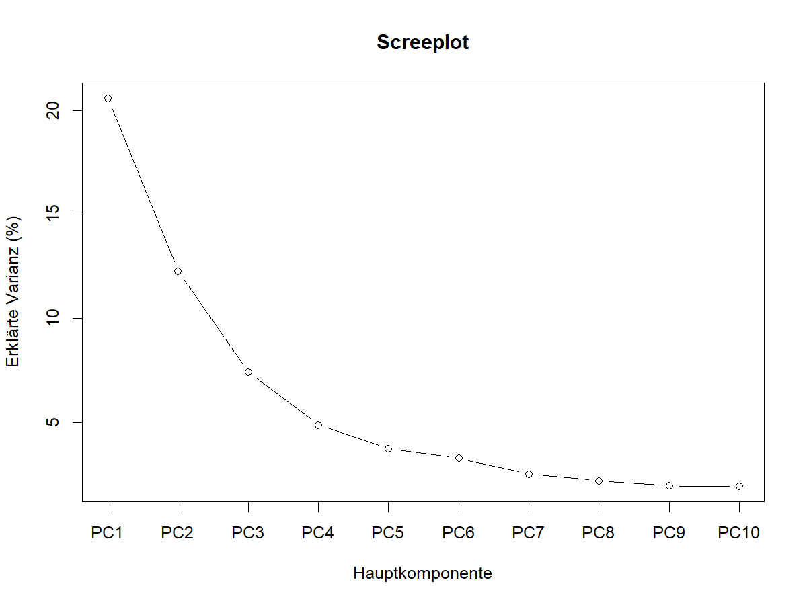
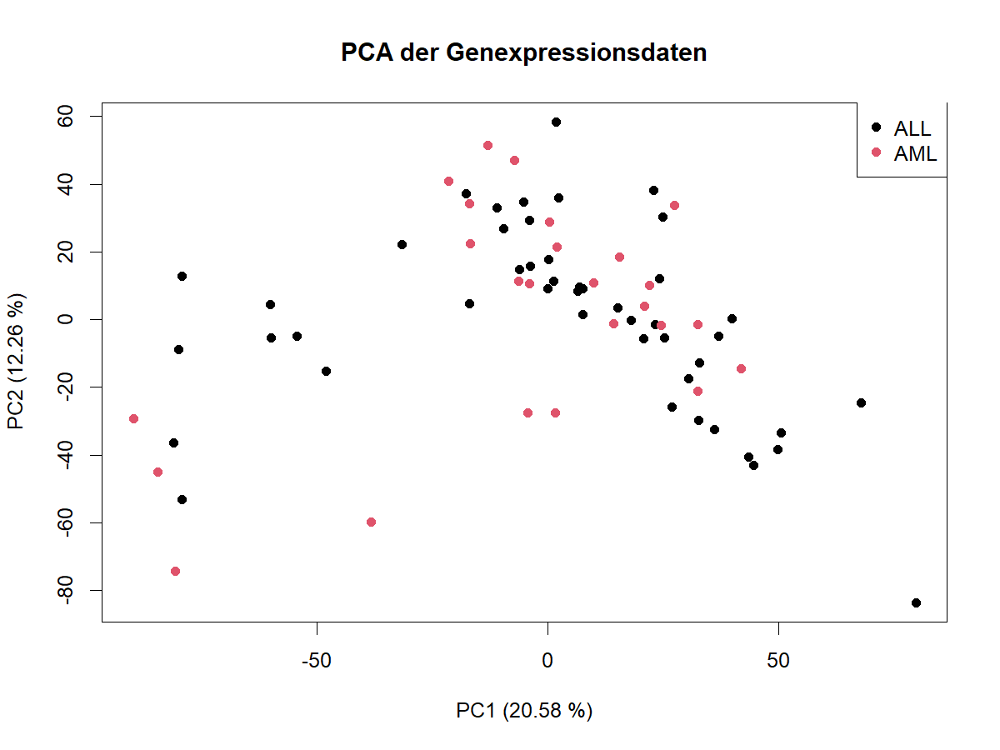
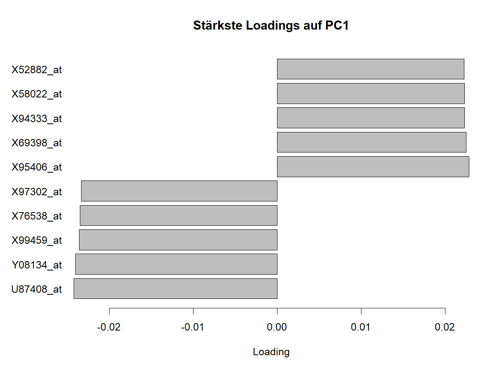
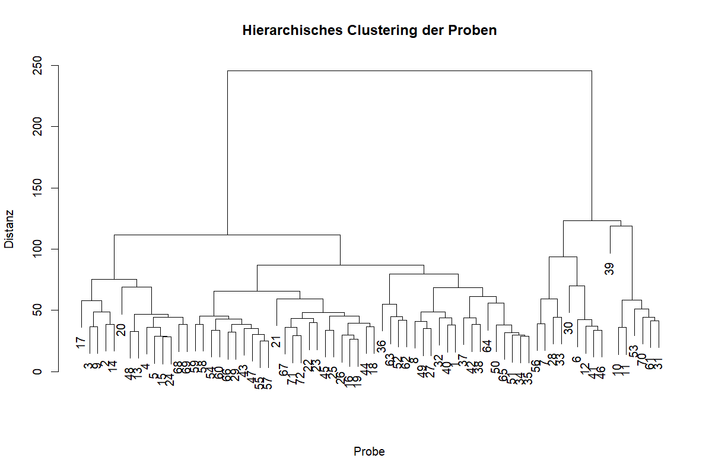
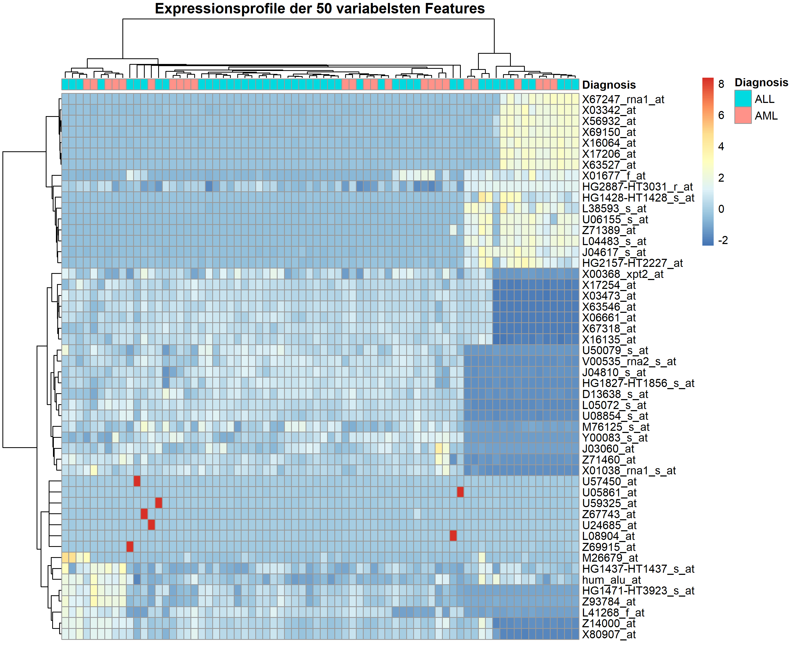

#  Einleitung

## Fragestellung

Ziel dieser Analyse ist es, die Genexpressionsdaten des Golub-Datensatzes
zu untersuchen und Unterschiede zwischen den beiden Leukämieformen
Acute Lymphoblastic Leukemia (ALL) und Acute Myeloid Leukemia (AML)
zu charakterisieren.

# Ergebnisse

## Hauptkomponentenanalyse (PCA)

Die erste Hauptkomponente (PC1) erklärte 20,58 % und die zweite Hauptkomponente (PC2) 12,26 % der Gesamtvarianz. Zusammen erklärten PC1 und PC2 somit 32,84 % der Varianz im Datensatz. Die Verteilung der erklärten Varianz ist in Abbildung 1 dargestellt.



*Abbildung 1: Screeplot der Hauptkomponentenanalyse mit dem Anteil der durch die einzelnen Hauptkomponenten erklärten Varianz.*

In der Darstellung der Proben entlang von PC1 und PC2 zeigte sich keine eindeutige Trennung zwischen den ALL- und AML-Proben. Die beiden Gruppen überlappten über weite Bereiche des PCA-Plots. Einzelne Proben lagen weiter vom Hauptbereich der übrigen Proben entfernt, insgesamt bildeten sich jedoch keine klar voneinander abgegrenzten Cluster entsprechend der Leukämieform. Die Verteilung der ALL- und AML-Proben ist in Abbildung 2 dargestellt.



*Abbildung 2: PCA der ALL- und AML-Proben anhand der ersten beiden Hauptkomponenten.*

Die Analyse der Loadings zeigte, welche Features besonders stark zu den ersten beiden Hauptkomponenten beitrugen. Zu den stärksten positiven Loadings von PC1 gehörten unter anderem CD47, TGOLN2, CRHBP und TCP1, während BBS9, SMPDL3B, AP3S2 und MPV17 zu den stärksten negativen Loadings zählten. Für PC2 zeigten PRKAR2A, PRKCE, SLC12A5, ZNF44 und NR4A3 starke positive Loadings. Zu den stärksten negativen Loadings gehörten SCN2A, FEV, MAP2K1 und MORF4L2. Die stärksten positiven und negativen Loadings von PC1 sind in Abbildung 3 dargestellt.



*Abbildung 3: Features mit den stärksten positiven und negativen Loadings auf PC1.*

## Differentielle Genexpression

### Fragestellung

Unterscheiden sich ALL und AML systematisch in ihrer Genexpression und lassen sich Expressionsmerkmale identifizieren, die zwischen den beiden Leukämieformen unterschiedlich ausgeprägt sind?

### Analyse

Für die Analyse wurde zunächst der initiale Datensatz mit 38 Proben verwendet. Dieser umfasst 27 ALL- und 11 AML-Proben.

Zur Untersuchung der differentiellen Genexpression wurde die Methode `limma` verwendet. Dabei wurde die Diagnose als Gruppierungsvariable mit den beiden Ausprägungen ALL und AML verwendet. Für die Expressionsmerkmale wurden lineare Modelle berechnet und anschließend mit `eBayes()` statistisch ausgewertet.

Da gleichzeitig sehr viele Expressionsmerkmale untersucht wurden, wurden die p-Werte mit der Benjamini-Hochberg-Methode für multiples Testen korrigiert. Als Signifikanzkriterium wurde eine False Discovery Rate (FDR) von < 0,05 verwendet.

```{r}
# Differential Gene Expression

# Vorbereitete Daten laden
invisible(capture.output(
  source("01_data_import_final.R", echo = FALSE, verbose = FALSE)
))

library(limma)

# Initialen Datensatz auswählen
initial_samples <- metadata$Dataset == "initial"

analysis_matrix_initial <- analysis_matrix[initial_samples, ]
metadata_initial <- metadata[initial_samples, ]

# Gruppierungsvariable erstellen
group <- factor(
  metadata_initial$Diagnosis,
  levels = c("ALL", "AML")
)

# Designmatrix erstellen
design <- model.matrix(~ group)

# Limma-Modell berechnen
fit <- lmFit(
  t(analysis_matrix_initial),
  design
)

fit <- eBayes(fit)

# Multiple-Test-Korrektur nach Benjamini-Hochberg
results <- topTable(
  fit,
  coef = "groupAML",
  number = Inf,
  adjust.method = "BH"
)

# Anzahl signifikanter Expressionsmerkmale
invisible(sum(results$adj.P.Val < 0.05))
```

### Ergebnisse

Insgesamt wurden 178 Expressionsmerkmale mit einer FDR < 0,05 identifiziert. Damit zeigen zahlreiche Expressionsmerkmale im untersuchten Datensatz statistisch signifikante Unterschiede zwischen ALL und AML.

Die Verteilung der Expressionsunterschiede und ihrer statistischen Signifikanz ist in Abbildung 4 dargestellt.

```{r}
# Differential-Expression-Plot

library(ggplot2)

results$significant <- results$adj.P.Val < 0.05

de_plot <- ggplot(
  results,
  aes(
    x = logFC,
    y = -log10(P.Value),
    color = significant
  )
) +
  geom_point(alpha = 0.6, size = 1.5) +
  geom_vline(
    xintercept = 0,
    linetype = "dashed"
  ) +
  labs(
    title = "Differential Gene Expression: AML vs. ALL",
    x = "Expression difference (AML vs. ALL)",
    y = "-log10(p-value)",
    color = "FDR < 0.05"
  ) +
  theme_minimal()

de_plot
```


*Abbildung 4: Differential-Expression-Plot für den Vergleich der Genexpression zwischen AML und ALL. Die hervorgehobenen Punkte entsprechen Expressionsmerkmalen mit einer FDR < 0,05.*

### Heatmap der Top-20-Expressionsmerkmale

Für eine detailliertere Betrachtung wurden die 20 Expressionsmerkmale mit den kleinsten adjustierten p-Werten ausgewählt. Die Expressionswerte wurden für die Darstellung zeilenweise standardisiert.

```{r}
# Heatmap der Top-20 differentiell exprimierten Merkmale

library(pheatmap)

# Signifikante Merkmale auswählen
sig_genes <- rownames(results)[results$adj.P.Val < 0.05]

# Nur Merkmale verwenden, die in der Expressionsmatrix vorhanden sind
sig_genes <- sig_genes[
  sig_genes %in% colnames(analysis_matrix_initial)
]

# Merkmale mit fehlenden Werten ausschließen
sig_genes <- sig_genes[
  !sapply(
    sig_genes,
    function(g) anyNA(analysis_matrix_initial[, g])
  )
]

# Nach adjustiertem p-Wert sortieren
sig_genes <- sig_genes[
  order(results[sig_genes, "adj.P.Val"])
]

# Top 20 auswählen
top20_genes <- head(sig_genes, 20)

# Expressionsmatrix für die Heatmap erstellen
heatmap_matrix <- t(
  analysis_matrix_initial[, top20_genes, drop = FALSE]
)

# Diagnose als Annotation
annotation_col <- data.frame(
  Diagnose = metadata_initial$Diagnosis
)

rownames(annotation_col) <- rownames(metadata_initial)

# Heatmap erstellen
pheatmap(
  heatmap_matrix,
  scale = "row",
  annotation_col = annotation_col,
  cluster_rows = TRUE,
  cluster_cols = TRUE,
  show_rownames = TRUE,
  show_colnames = FALSE,
  main = "Top 20 differentiell exprimierte Gene"
)
```


*Abbildung 5: Heatmap der 20 am stärksten differentiell exprimierten Expressionsmerkmale im initialen Datensatz. Die Proben sind entsprechend ihrer Diagnose als ALL oder AML annotiert.*

Die Heatmap zeigt unterschiedliche Expressionsmuster der ausgewählten Merkmale über die untersuchten Proben. Die Annotation der Proben ermöglicht dabei einen direkten Vergleich der Expressionsmuster zwischen ALL und AML.

### Interpretation

Die Analyse zeigt, dass sich ALL und AML im untersuchten Datensatz in mehreren Expressionsmerkmalen systematisch unterscheiden. Dies unterstützt die Hypothese, dass sich die beiden Leukämieformen anhand ihrer Genexpressionsprofile unterscheiden lassen.

Die identifizierten Expressionsmerkmale sollten dabei als statistisch unterschiedliche Merkmale zwischen den beiden Gruppen interpretiert werden und nicht als einzelne diagnostische Marker.

### Biologische Einordnung ausgewählter Merkmale

Unter den 20 am stärksten differentiell exprimierten Merkmalen befinden sich mehrere Probe-Sets, die bereits in früheren Analysen des Golub-Leukämiedatensatzes als relevante Merkmale für die Unterscheidung von ALL und AML beschrieben wurden.

Beispielsweise entspricht `L08246_at` dem Gen **MCL1 (myeloid cell leukemia 1)**. MCL1 ist an der Regulation des Zellüberlebens beteiligt. `M11147_at` entspricht **FTL (ferritin light chain)**, einem Bestandteil des Ferritin-Komplexes, der an der intrazellulären Eisenspeicherung beteiligt ist. `Y00787_s_at` entspricht **IL8/CXCL8 (Interleukin-8)**, einem Chemokin, das an Entzündungs- und Signalprozessen beteiligt ist. Auch `U46751_at`, das für das p62-Protein (SQSTM1) steht, wurde in früheren Analysen des Golub-Datensatzes als relevantes Expressionsmerkmal beschrieben.

Die Übereinstimmung einzelner identifizierter Merkmale mit früheren Analysen des Golub-Datensatzes unterstützt die biologische Relevanz der gefundenen Expressionsunterschiede. Die Ergebnisse stellen jedoch keine Aussage darüber dar, dass einzelne Gene allein zur Diagnose von ALL oder AML ausreichen.

### Limitationen

Die Analyse basiert auf dem initialen Datensatz mit 38 Proben, darunter 27 ALL- und 11 AML-Proben. Aufgrund der unterschiedlichen Gruppengrößen und der insgesamt begrenzten Stichprobengröße sollten die identifizierten Expressionsunterschiede mit Vorsicht interpretiert werden.

Außerdem wurden die Expressionsmerkmale anhand ihrer statistischen Signifikanz ausgewählt. Eine statistische Signifikanz einzelner Merkmale bedeutet dabei nicht automatisch eine biologische oder diagnostische Relevanz. Für eine weitergehende Bewertung wären unabhängige Datensätze und zusätzliche biologische Validierungen erforderlich.

Der vollständige R-Code zur Analyse der differentiellen Genexpression ist zusätzlich im R-Skript "05_differential_expression.R" im Repository dokumentiert.

## Clustering

Ziel der Clusteranalyse war es zu untersuchen, ob sich anhand der Genexpressionsprofile ohne Verwendung der bekannten Diagnose natürliche Gruppen innerhalb der Proben identifizieren lassen und ob diese Gruppen mit den Diagnosen ALL und AML übereinstimmen.

### Datenvorbereitung

Für die Clusteranalyse wurde die zuvor bereinigte Expressionsmatrix verwendet. Features mit fehlenden Werten wurden ausgeschlossen, da die verwendeten Distanz- und Clusteringverfahren vollständige Daten voraussetzen. Anschließend wurden die 25 % der Features mit der höchsten Varianz ausgewählt. Dadurch sollten wenig variable Features, die nur wenig zur Unterscheidung der Proben beitragen, bei der Distanzberechnung weniger Einfluss erhalten. Die Feature-Auswahl erfolgte unabhängig von der bekannten Diagnose, um den unüberwachten Charakter der Clusteranalyse zu erhalten.

Die ausgewählten Features wurden anschließend standardisiert. Dadurch besitzen die Features einen Mittelwert von 0 und eine Standardabweichung von 1, sodass Unterschiede in der Größenordnung der Expressionswerte die Distanzberechnung nicht dominieren.

### Hierarchisches Clustering

Für das hierarchische Clustering wurden euklidische Distanzen zwischen den Proben auf Grundlage der standardisierten Expressionswerte berechnet. Als Linkage-Methode wurde Ward.D2 verwendet. Dabei werden schrittweise diejenigen Cluster zusammengeführt, deren Zusammenführung zu einem möglichst geringen Anstieg der Streuung innerhalb der Cluster führt. Das resultierende Dendrogramm wurde anschließend in zwei Cluster unterteilt, um die erhaltene Gruppierung mit den beiden Diagnosen ALL und AML vergleichen zu können.



*Abbildung 6: Dendrogramm des hierarchischen Clusterings der Proben anhand der Genexpressionsprofile.*

### Vergleich mit der ALL/AML-Diagnose

Das hierarchische Clustering ergab zwei unterschiedlich große Cluster. Cluster 1 umfasste 16 Proben und Cluster 2 umfasste 56 Proben. Um zu untersuchen, ob diese Gruppierung mit der bekannten Diagnose übereinstimmt, wurde die Verteilung der ALL- und AML-Proben auf die beiden Cluster betrachtet.

Cluster 1 enthielt 10 ALL- und 6 AML-Proben, während Cluster 2 aus 37 ALL- und 19 AML-Proben bestand. Beide Diagnosen waren somit in beiden Clustern vertreten. Eine eindeutige Trennung der Proben nach ALL und AML war anhand der Clusterzugehörigkeit nicht erkennbar.

Um zu prüfen, ob dennoch ein statistischer Zusammenhang zwischen Clusterzugehörigkeit und Diagnose bestand, wurde ein Fisher-Exakt-Test durchgeführt.

Der Fisher-Exakt-Test ergab keinen statistisch signifikanten Zusammenhang zwischen Clusterzugehörigkeit und ALL/AML-Diagnose (p = 0,775). Die durch das hierarchische Clustering identifizierte Gruppierung entsprach somit nicht der bekannten diagnostischen Einteilung in ALL und AML.

### Heatmap der Expressionsprofile

Zur Visualisierung der Expressionsmuster wurden die 50 Features mit der höchsten Varianz dargestellt. Die Heatmap basiert auf den zuvor standardisierten Expressionswerten. Die Proben wurden in der Heatmap erneut anhand euklidischer Distanzen und Ward.D2 hierarchisch angeordnet. Zusätzlich wurde die bekannte ALL/AML-Diagnose der einzelnen Proben als Annotation dargestellt.



*Abbildung 7: Heatmap der 50 variabelsten Features. Die Annotation zeigt die bekannte ALL/AML-Diagnose der Proben.*

Die Heatmap zeigte deutliche Unterschiede in den Expressionsmustern zwischen einzelnen Probengruppen. Die ALL- und AML-Proben waren jedoch über die verschiedenen Äste des hierarchischen Clusterings verteilt und bildeten keine klar voneinander getrennten Gruppen. Damit unterstützt die Visualisierung das Ergebnis des vorherigen Vergleichs zwischen Clusterzugehörigkeit und Diagnose.

Die Heatmap dient dabei primär der Visualisierung charakteristischer Expressionsmuster und basiert aus Gründen der Darstellbarkeit nur auf den 50 variabelsten Features, während das zuvor durchgeführte hierarchische Clustering auf den 25 % variabelsten Features basierte.

### K-means-Clustering

Ergänzend zum hierarchischen Clustering wurde ein k-means-Clustering mit zwei Clustern durchgeführt. Dadurch sollte untersucht werden, ob ein alternatives unüberwachtes Clusteringverfahren eine vergleichbare Gruppierung der Proben ergibt. Um den Einfluss der zufälligen Initialisierung zu reduzieren, wurden 25 verschiedene Startkonfigurationen verwendet. Für die Reproduzierbarkeit wurde zuvor ein fester Zufallsstart gesetzt.

Auch das k-means-Clustering ergab zwei Cluster mit 16 bzw. 56 Proben. Cluster 1 enthielt 10 ALL- und 6 AML-Proben, Cluster 2 enthielt 37 ALL- und 19 AML-Proben. Damit zeigte sich auch beim k-means-Clustering keine eindeutige Trennung von ALL und AML.

Um zu überprüfen, ob beide Clusteringverfahren lediglich gleich große oder tatsächlich identische Cluster erzeugten, wurden die individuellen Clusterzuordnungen miteinander verglichen.

Das hierarchische Clustering und das k-means-Clustering führten zu einer identischen Zuordnung aller 72 Proben. Beide Verfahren identifizierten somit dieselbe Struktur in den Expressionsdaten. Diese Gruppierung entsprach jedoch nicht der bekannten Einteilung in ALL und AML.

### Sensitivitätsanalyse

Um zu überprüfen, ob die Ergebnisse von der gewählten Datenvorverarbeitung abhängen, wurde das hierarchische Clustering zusätzlich mit unterschiedlichen Anteilen variabler Features sowie ohne Standardisierung durchgeführt.

Das Clustering ohne Standardisierung führte zu einer identischen Zuordnung aller 72 Proben wie die standardisierte Analyse. Auch bei Verwendung der 10 %, 25 % und 50 % variabelsten Features waren die Clusterzuordnungen identisch. Bei Verwendung aller 7.059 vollständigen Features änderte sich die Zuordnung von vier der 72 Proben. Die fehlende Übereinstimmung der Cluster mit der ALL/AML-Diagnose blieb dabei bestehen. Die Ergebnisse erwiesen sich somit als robust gegenüber den untersuchten Varianten der Datenvorverarbeitung.

### Fazit der Clusteranalyse

Für die gewählte Feature-Auswahl identifizierten sowohl hierarchisches Clustering als auch k-means dieselbe Gruppierung der 72 Proben in zwei Cluster mit 16 bzw. 56 Proben. Sowohl das hierarchische Clustering mit euklidischer Distanz und Ward.D2 als auch das k-means-Clustering führten zu einer identischen Zuordnung der Proben. Die gefundene Clusterstruktur entsprach jedoch nicht der bekannten Einteilung in ALL und AML. Der Fisher-Exakt-Test zeigte keinen statistisch signifikanten Zusammenhang zwischen Clusterzugehörigkeit und Diagnose (p = 0,775). Auch die Heatmap der 50 variabelsten Features zeigte keine eindeutige Trennung der beiden Diagnosegruppen.

