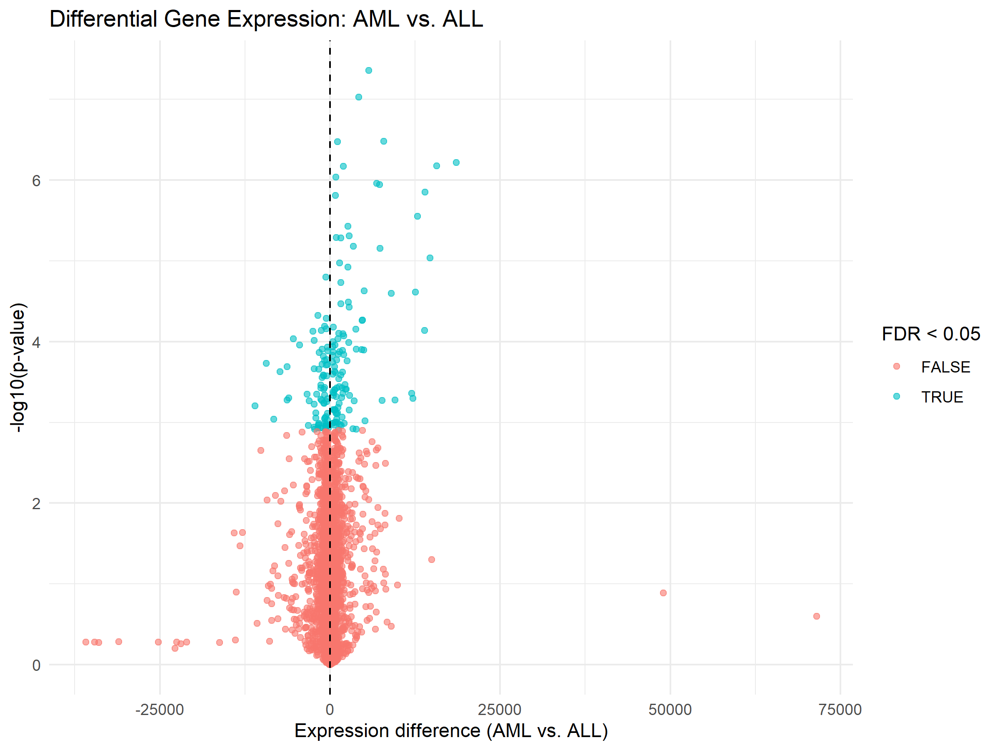
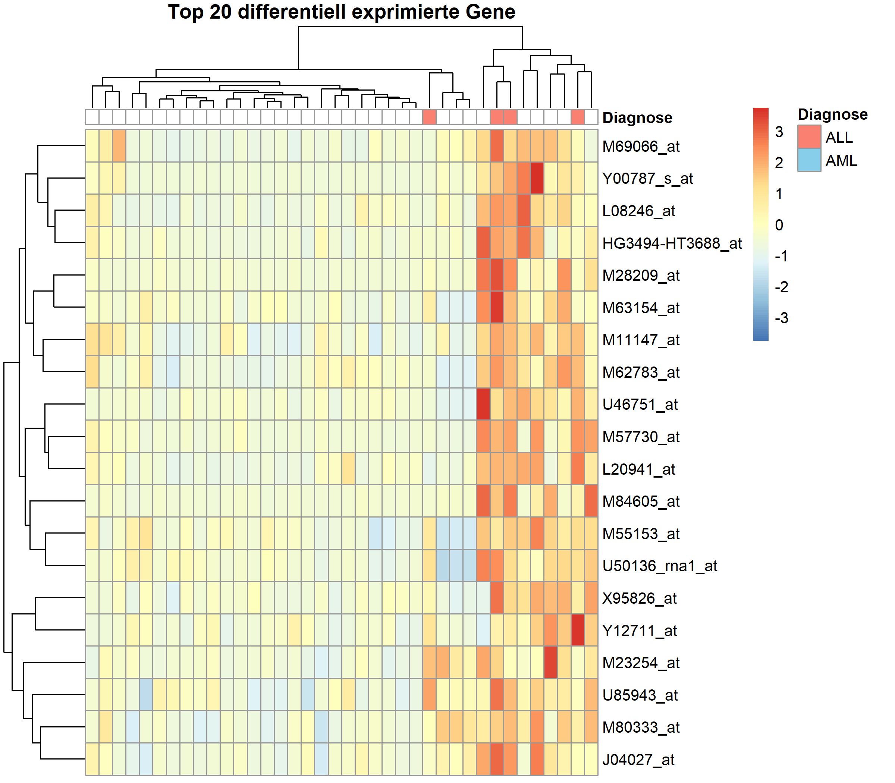

# Ergebnisse

## Hauptkomponentenanalyse (PCA)

Die erste Hauptkomponente (PC1) erklärte 20,58 % und die zweite Hauptkomponente (PC2) 12,26 % der Gesamtvarianz. Zusammen erklärten PC1 und PC2 somit 32,84 % der Varianz im Datensatz. Die Verteilung der erklärten Varianz ist in Abbildung 1 dargestellt.

*Abbildung 1: Screeplot der Hauptkomponentenanalyse mit dem Anteil der durch die einzelnen Hauptkomponenten erklärten Varianz.*

In der Darstellung der Proben entlang von PC1 und PC2 zeigte sich keine eindeutige Trennung zwischen den ALL- und AML-Proben. Die beiden Gruppen überlappten über weite Bereiche des PCA-Plots. Einzelne Proben lagen weiter vom Hauptbereich der übrigen Proben entfernt, insgesamt bildeten sich jedoch keine klar voneinander abgegrenzten Cluster entsprechend der Leukämieform. Die Verteilung der ALL- und AML-Proben ist in Abbildung 2 dargestellt.

*Abbildung 2: PCA der ALL- und AML-Proben anhand der ersten beiden Hauptkomponenten.*

Die Analyse der Loadings zeigte, welche Features besonders stark zu den ersten beiden Hauptkomponenten beitrugen. Zu den stärksten positiven Loadings von PC1 gehörten unter anderem CD47, TGOLN2, CRHBP und TCP1, während BBS9, SMPDL3B, AP3S2 und MPV17 zu den stärksten negativen Loadings zählten. Für PC2 zeigten PRKAR2A, PRKCE, SLC12A5, ZNF44 und NR4A3 starke positive Loadings. Zu den stärksten negativen Loadings gehörten SCN2A, FEV, MAP2K1 und MORF4L2. Die stärksten positiven und negativen Loadings von PC1 sind in Abbildung 3 dargestellt.

*Abbildung 3: Features mit den stärksten positiven und negativen Loadings auf PC1.*

## Differentielle Genexpression

### Fragestellung

Unterscheiden sich ALL und AML systematisch in ihrer Genexpression und lassen sich Expressionsmerkmale identifizieren, die zwischen den beiden Leukämieformen unterschiedlich ausgeprägt sind?

### Analyse

Für die Analyse wurde zunächst der initiale Datensatz mit 38 Proben verwendet. Dieser umfasst 27 ALL- und 11 AML-Proben.

Zur Untersuchung der differentiellen Genexpression wurde die Methode `limma` verwendet. Dabei wurde die Diagnose als Gruppierungsvariable mit den beiden Ausprägungen ALL und AML verwendet. Für die Expressionsmerkmale wurden lineare Modelle berechnet und anschließend mit `eBayes()` statistisch ausgewertet.

Da gleichzeitig sehr viele Expressionsmerkmale untersucht wurden, wurden die p-Werte mit der Benjamini-Hochberg-Methode für multiples Testen korrigiert. Als Signifikanzkriterium wurde eine False Discovery Rate (FDR) von < 0,05 verwendet.

### Ergebnisse

Insgesamt wurden 178 Expressionsmerkmale mit einer FDR < 0,05 identifiziert. Damit zeigen zahlreiche Expressionsmerkmale im untersuchten Datensatz statistisch signifikante Unterschiede zwischen ALL und AML.

Die Verteilung der Expressionsunterschiede und ihrer statistischen Signifikanz ist in Abbildung 4 dargestellt.

*Abbildung 4: Differential-Expression-Plot für den Vergleich der Genexpression zwischen AML und ALL. Die hervorgehobenen Punkte entsprechen Expressionsmerkmalen mit einer FDR < 0,05.*

### Heatmap der Top-20-Expressionsmerkmale

Für eine detailliertere Betrachtung wurden die 20 Expressionsmerkmale mit den kleinsten adjustierten p-Werten ausgewählt. Die Expressionswerte wurden für die Darstellung zeilenweise standardisiert.

*Abbildung 5: Heatmap der 20 am stärksten differentiell exprimierten Expressionsmerkmale im initialen Datensatz. Die Proben sind entsprechend ihrer Diagnose als ALL oder AML annotiert.*

Die Heatmap zeigt unterschiedliche Expressionsmuster der ausgewählten Merkmale über die untersuchten Proben. Die Annotation der Proben ermöglicht dabei einen direkten Vergleich der Expressionsmuster zwischen ALL und AML.

### Interpretation

Die Analyse zeigt, dass sich ALL und AML im untersuchten Datensatz in mehreren Expressionsmerkmalen systematisch unterscheiden. Dies unterstützt die Hypothese, dass sich die beiden Leukämieformen anhand ihrer Genexpressionsprofile unterscheiden lassen.

Die identifizierten Expressionsmerkmale sollten dabei als statistisch unterschiedliche Merkmale zwischen den beiden Gruppen interpretiert werden und nicht als einzelne diagnostische Marker.

### Biologische Einordnung ausgewählter Merkmale

Unter den 20 am stärksten differentiell exprimierten Merkmalen befinden sich mehrere Probe-Sets, die bereits in früheren Analysen des Golub-Leukämiedatensatzes als relevante Merkmale für die Unterscheidung von ALL und AML beschrieben wurden.

Beispielsweise entspricht `L08246_at` dem Gen **MCL1 (myeloid cell leukemia 1)**. MCL1 ist an der Regulation des Zellüberlebens beteiligt. `M11147_at` entspricht **FTL (ferritin light chain)**, einem Bestandteil des Ferritin-Komplexes, der an der intrazellulären Eisenspeicherung beteiligt ist. `Y00787_s_at` entspricht **IL8/CXCL8 (Interleukin-8)**, einem Chemokin, das an Entzündungs- und Signalprozessen beteiligt ist. Auch `U46751_at`, das für das p62-Protein (SQSTM1) steht, wurde in früheren Analysen des Golub-Datensatzes als relevantes Expressionsmerkmal beschrieben.

Die Übereinstimmung einzelner identifizierter Merkmale mit früheren Analysen des Golub-Datensatzes unterstützt die biologische Relevanz der gefundenen Expressionsunterschiede. Die Ergebnisse stellen jedoch keine Aussage darüber dar, dass einzelne Gene allein zur Diagnose von ALL oder AML ausreichen.
